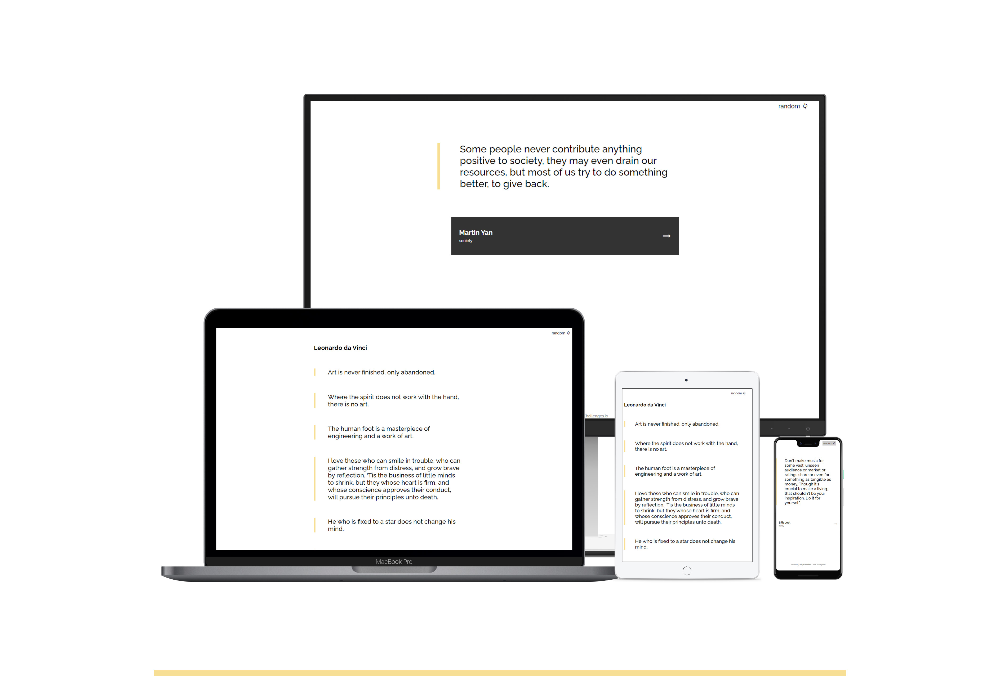

# Quotes Generator

Solution for a challenge from Devchallenges.io

---

#### Table of Contents

-   [The Project](#project)
    -   [Built With](#built-with)
    -   [Features](#features)
    -   [How to use](#how-to-use)
-   [Contact](#contact)

---

## Project



### Built With

-   [React](https://reactjs.org/)
-   Bootstrapped with [Create React App](https://github.com/facebook/create-react-app).
-   [Quote Garden API](https://pprathameshmore.github.io/QuoteGarden/)
-   [Material Design Icons](https://google.github.io/material-design-icons/)
-   Deployed on [Netlify](https://www.netlify.com/)

### Features

This application/site was created as a submission to a [DevChallenges](https://devchallenges.io/challenges) challenge. The [challenge](https://devchallenges.io/challenges/8Y3J4ucAMQpSnYTwwWW8) was to build an application to complete the given user stories:

### How To Use

To clone and run this application, you'll need [Git](https://git-scm.com) and [Node.js](https://nodejs.org/en/download/) (which comes with [npm](http://npmjs.com)) installed on your computer. From your command line:

```bash
# Clone this repository
$ git clone https://github.com/Tanya-Amber-L/Quotes-Generator

# Install dependencies
$ npm install

# Run the app
$ npm start
```

## Contact

-   [Website: tleenders.be](https://tleenders.be)
-   [GitHub: Tanya-Amber-L](https://github.com/Tanya-Amber-L)
